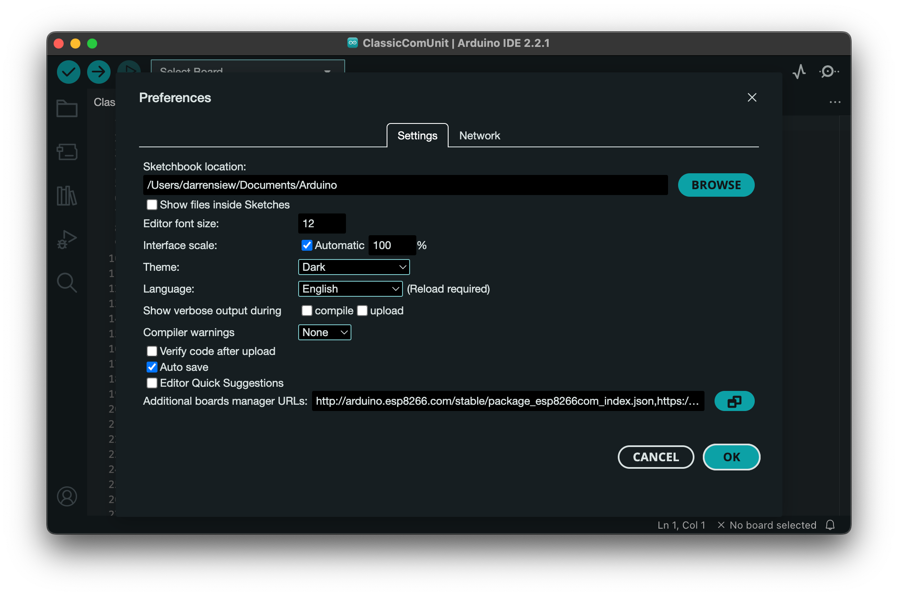
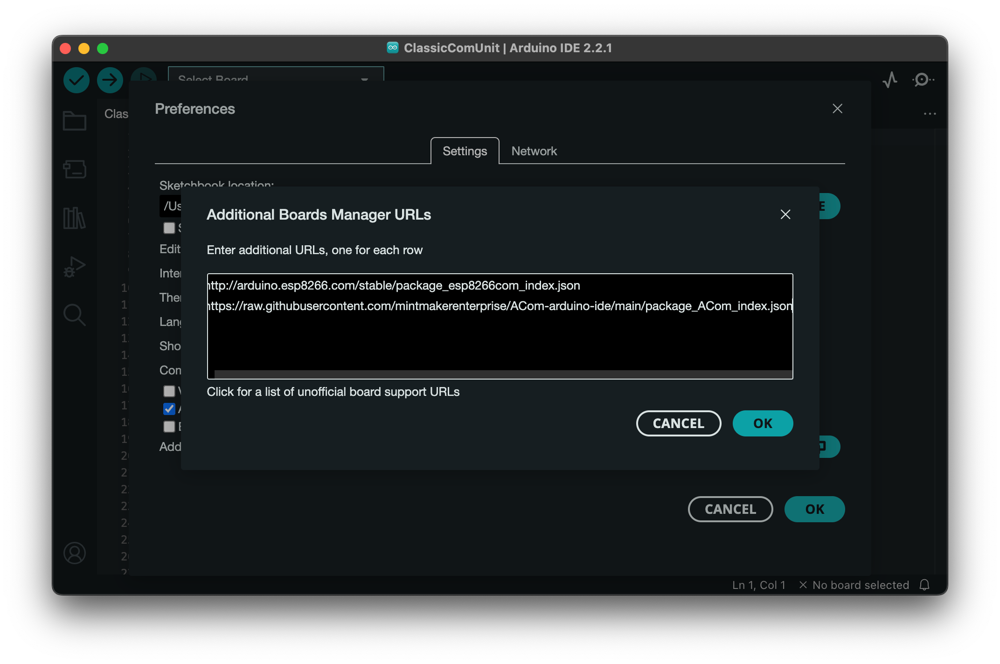
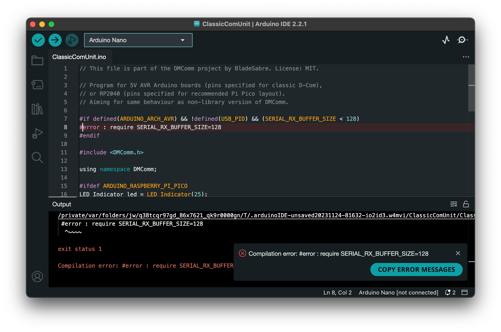
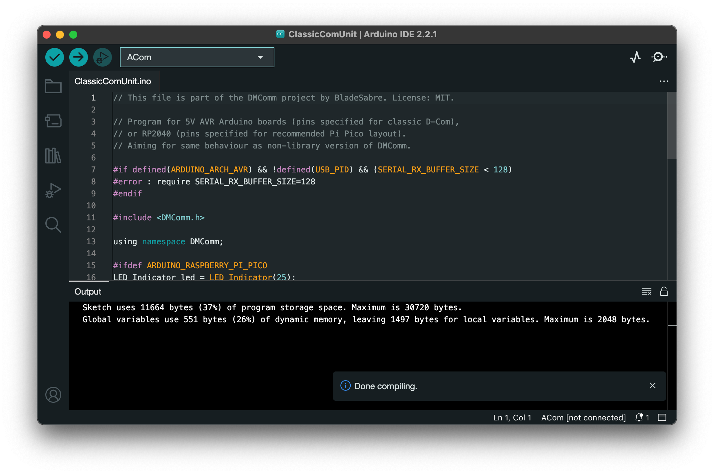

# ACom-arduino-ide
To create an custom board for ACom in Arduino IDE and simplify the steps mentioned in DMComm.

The custom board has simplified steps below. 
* Nano/Uno:
  * From the Arduino15 folder, go to `packages/arduino/hardware/avr/{version}`
  * Create `platform.local.txt` containing `compiler.cpp.extra_flags=-DSERIAL_RX_BUFFER_SIZE=128`
  * Restart the Arduino IDE

## Related information

Copy and paste the following URL into the File > Preferences > "Additional Boards Manager" textbox.

```
https://raw.githubusercontent.com/mintmakerenterprise/ACom-arduino-ide/main/package_ACom_index.json
```

Make sure to also install the DMComm library at the same time.
```
https://github.com/dmcomm/dmcomm-arduino-lib
```

## Steps to setup in Arduino IDE

Adding custom board at "Additional board manager URL"


click the green button at right side to access more board URL



Compiling using Arduino Nano



Compiling using ACom custom board

